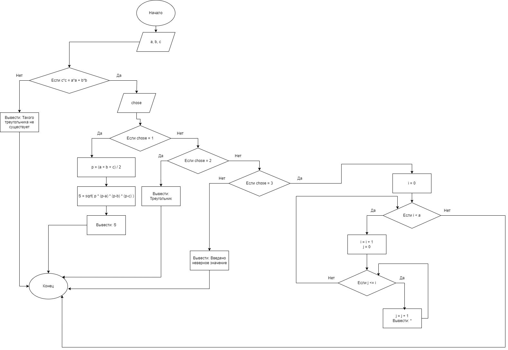

# Домашнее задание к работе 10
Задание 3  (индивидуальное). Составьте программу, которая для заданной пользователем фигуры, например прямоугольника (треугольника или другой фигуры см. инидивидуальное задание работы 9) предлагает меню выбора одной из операций:
1) рассчитать площадь;
2) вывести определение фигуры;
3) нарисовать фигуру.

### Блок-схема
 
